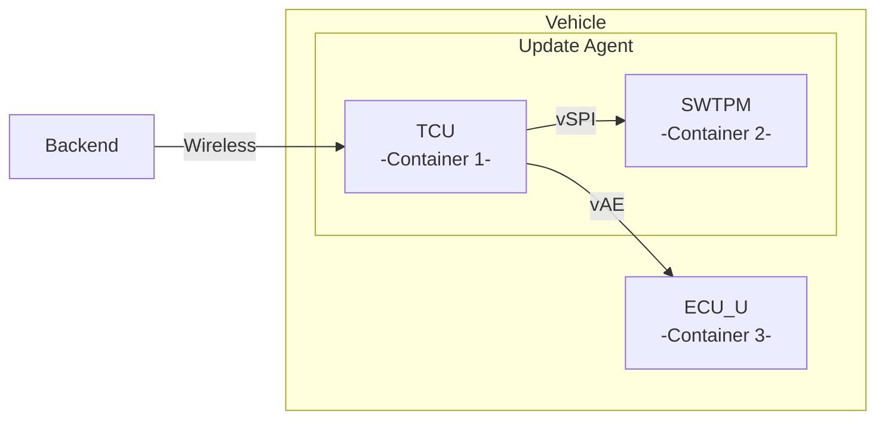

# Update Reporting

This project demonstrates a lightweight ECU software state reporting mechanism
utilizing the TPM2.0 as central security policy enforcement point. The
electronic control units (ECUs) in the vehicle report their currently running
software version to the TPM2.0 in a secure and lightweight way. Depending on
the ECUs software state, the TPM2.0 may authorize to transition the vehicle
from an update-ready state back to the fully functional drive mode, e.g., after
an OTA software update was successfully installed.

## Modules

To show this, we create a virtual automotive network and corresponding backend
server via Docker containers. The telematics control unit (TCU) is attached to
the TPM via a virtualized SPI bus (vSPI), while the TCU is connected to the
update target ECU (ECU_U) via virtualized (Automotive) Ethernet (vAE).



## General Container Setup and Management

To get the project working, [Docker Compose](https://docs.docker.com/compose/)
needs to be installed. The docker compose file defines all networking between
the containers. These commands are the most important:

```
1. docker compose -f docker-compose.yml build # build all the container images
2. docker compose -f docker-compose.yml up -d # start all containers and detach
3. docker compose -f docker-compose.yml down  # stop and reset all containers
```

## TPM HW and Software Simulator

Per default, the project is compiled using a software TPM (SWTPM). However, if
available, also a hardware TPM can be used. To switch between both variants the
TCTI needs to be specified accordingly:

1. SWTPM: `TCTI = "swtpm:host=10.0.0.20,port=2321"`
2. HWTPM: `TCTI = "device:/dev/tpm0"`

## Usage

### Build and Startup Containers

First, build and start the containers of TCU and ECU in our virtual automotive
network.

```
1. docker compose -f docker-compose.yml build
2. docker compose -f docker-compose.yml up -d
```

### System Provisioning

In a first step, the system is provisioned with respective keys.


#### Session1 (with TPM): Terminal Window 1 / Computer 1 

First, login into the Docker container of the TCU with attached TPM.

```
1. docker exec -w /tmp/src -it update-reporting-tcu /bin/bash
```

Create backend keys with the RSA or ECC algorithm. Additionally, a symmetric key
for HMAC (*here:* 1234567890) is always created. The choice of the asymmetric
algorithm must be consistent throughout this whole example. This script will
also select the corresponding TPM profile that is used later to provision the
TPM. Copy the private or symmetric key.

```
- Choose a variant
a) RSA (+HMAC)
  - bash main_tpm.sh createbackendkeys keys rsa "1234567890"
b) ECC (+HMAC)
  - bash main_tpm.sh createbackendkeys keys ecc "1234567890"
```

Provision the TPM by initializing the key hierarchy, creating the initial
authorization policy bound to the backend key, creating the attestation key
bound to the Key Sealing Policy (KSP), the HMAC key, revocation counter, and
the reporting bit field.

```
1. tss2 provision (warnings about not existing directories are ok, they will be created here)
2. bash main_tpm.sh provision keys/backend_pub.pem HS/SRK/attestkey HS/SRK/symkey keys/symkey /nv/Owner/rev_ctr /nv/Owner/nv_report 1
3. bash main_tpm.sh createreadpolicy keys/backend_pub.pem data
```

Copy keys and paste them into new terminal (cf. next step)

```
a) Asymmetric (RSA/ECC)
  - cat keys/ecu_priv.pem (copy -> paste; according to next step 2a)
  - cat keys/tpm_pub.pem (copy -> paste; according to next step 2a)
b) Symmetric (HMAC)
  - cat keys/symkey
```

#### Session2 (no TPM): Terminal Window 2 / Computer 2

Second, login into the Docker container of the ECU and paste the copied keys
into the keys folder. Afterwards, provision the ECU with the copied key.

```
1. docker exec -w /tmp/src -it update-reporting-ecuu /bin/bash
2. mkdir -p keys && touch keys/ecu_priv.pem keys/tpm_pub.pem keys/sym.key
3. Paste copied key (create necessary folders and files in /tmp/src)
  a) Asymmetric
    - vi keys/ecu_priv.pem (Paste ecu_priv.pem)
    - vi keys/tpm_pub.pem (Paste tpm_pub.pem)
  b) Symmetric 
    - vi keys/sym.key (Paste sym.key)
4. Provision alternatives
  a) Asymmetric
    - bash main_ecu.sh provision keys/ecu_priv.pem keys/tpm_pub.pem
  b) Symmetric
    - bash main_ecu.sh provision keys/sym.key
```

#### Session1 (with TPM): Terminal Window 1 / Computer 1

Create (and instantiate and sign) the ECU Authorization Policy (EAP) with
asymmetric/symmetric PolicySigned.


```
- Choose either asymmetric or symmetric depending on what you have chosen before (for asymmetric the correct key for ECC or RSA will automatically be chosen)
a) Asymmetric
  - bash main_tpm.sh createeappolicy keys/backend_pub.pem keys/ecu_pub.pem /nv/Owner/rev_ctr /nv/Owner/nv_report 1 data
b) Symmetric
  - bash main_tpm.sh createeappolicy keys/backend_pub.pem HS/SRK/symkey /nv/Owner/rev_ctr /nv/Owner/nv_report 1 data
```

_Hint: For consecutive execution the bitmap (1) needs to be changed, e.g., 2,3,4,5,6,7 ..._


### Set Bits from ECU (1. Secure ECU Attestation)

In this step, the ECU securely reports to the TPM using the ECU attestation key
(symmetric or asymmetric).

#### Session2 (no TPM): Terminal Window 2 / Computer 2 (udp server)

Start ECU in listening mode to wait for incoming challenge from the TCU
(with attached TPM).

```
1. bash main_ecu.sh answerchallenge
```

#### Session1 (with TPM): Terminal Window 1 / Computer 1 (udp client)

Try to set bits in the TPM. The bit field is bound to EAP. Thus, a challenge
(nonce) is returned by the TPM that is sent to the ECU. The ECU answers this
challenge with its attestation key and sends the response back. The TPM
verifies the response (and the revocation counter) and authorizes write access
to exactly the bit that the ECU is authorized to write to using the CPHash
command.

```
- Choose either asymmetric or symmetric depending on what you have chosen before (for asymmetric the correct key for ECC or RSA will automatically be chosen)
a) Asymmetric
  - bash main_tpm.sh authorizewrite data/eap_authorized.policy /nv/Owner/nv_report keys/ecu_priv.pem 1
b) Symmetric
  - bash main_tpm.sh authorizewrite data/eap_authorized.policy /nv/Owner/nv_report keys/symkey 1
```

Both session will report execution and transmission times.

### Unlock Attestation Key (2. Authorized State Transition)

In this step, the vehicle attestation key is unlocked depending on the state of
the bit field. Only if it is in the correct state (all required ECUs successfully
authorized to and set their corresponding bit), the attestation key is unlocked
and used to prove correct (benign) vehicle state to a verifier. 

#### Session1 (with TPM): Terminal Window 1 / Computer 1 (udp server)

Start TCU (with attached TPM) in listening mode to wait for incoming challenge from the verifier ECU.

```
- Choose the correct variant
a) RSA
  - bash main_tpm.sh answerchallenge HS/SRK/attestkey /nv/Owner/nv_report 1 rsa
b) ECC
  - bash main_tpm.sh answerchallenge HS/SRK/attestkey /nv/Owner/nv_report 1 ecc
c) HMAC
  - bash main_tpm.sh answerchallenge HS/SRK/symkey /nv/Owner/nv_report 1 hmac "1234567890"
```

#### Session2 (no TPM): Terminal Window 2 / Computer 2 (udp client)

On the ECU, create a nonce and send it to the TCU. The TCU will forward the nonce to the TPM. The TPM tries using the corresponding signing key. However, its usage is bound to the KSP. Thus, only if the bit field is in the correct (benign state), i.e., all required ECUs have authorized towards and set their corresponding bit, key usage is unlocked and the TPM can successfully sign the challenge. The TPM sends back the challenge to the ECU. The ECU verifies it and upon successful verification can transition the vehicle in a drive-ready state.

```
- Choose the correct variant
a) RSA
  - bash main_ecu.sh sendnonce rsa
b) ECC
  - bash main_ecu.sh sendnonce ecc
c) HMAC
  - bash main_ecu.sh sendnonce hmac "1234567890"
```